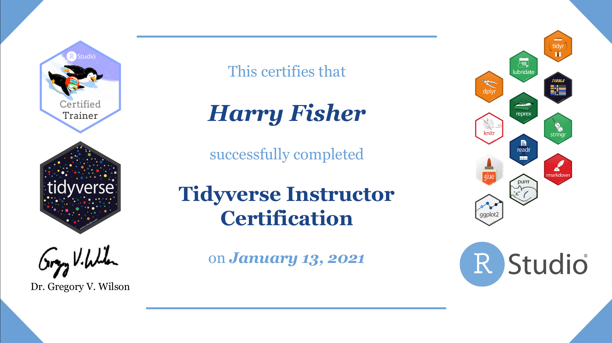

# What's this all about?

Recently, I became a certified RStudio instructor and thought I'd share a few of my thoughts on the process. 

**First, a little background...**

During my PhD, I discovered R almost by accident while I was battling the twin-headed demon of Microsoft excel and SPSS, trying with all my might to reshape my data and run some kind (any kind...!) of analysis.  

At some point I came across `reshape2::melt` which described exactly what I wanted to do with my data at that point in time, melt it into oblivion... However, with a bit more googling I actually figured out how to get my data from wide to long format. The sense of accomplishment was palpable. I was hooked. 

By the end of my PhD I had written my thesis completely in R markdown, worked closely with the author of `bnlearn` who helped shaped the analysis I undertook, and managed to get my first job as a data scientist in the financial crime and compliance sector, an alien world for someone with a sports science PhD, but learning R had given me a viable set of skills that someone would actually pay me to use... Who'd of thought! 

While my journey into R was a little haphazard and certainly took me far longer to figure things out than it should have, I really wanted to try and share my experiences and help someone else who may be in a similar position to me when I first started.

# Becoming certified

I saw the certification process offered by RStudio as a great opportunity to firstly test my understanding of R but also learn how to best educate others in an effective way. While I had some experience teaching in my PhD, I was never "taught" how to teach. I have definitely been guilty for firing up a powerpoint and talking for 50 minutes, clicking though slides and feeling pretty overwhelmed by all the blank faces staring back at me... 

I had also tried to convert some of my fellow students to R users by showing them how _easy_ it was to _just_ read in data, clean data, fit a model and produce a report. "All you have to do is type these functions and press knit!" I would exclaim, often met with bamboozled looks from my audience... 

```{r out.width="50%", fig.align='center'}
knitr::include_graphics("bamboozled.jpeg")
```

Unsurprisingly, there are far better ways to teach...! 

# The process 

The best place to find out about the certification process is the RStudio site, which has lots of information about the course: https://education.rstudio.com/trainers/.

In short form, the process looks something like this:

1. **Attend 2 day course of modern teaching practices led by Greg Wilson** (content is shared [here](https://drive.google.com/drive/folders/13ohFt3D0EJ5PDbMaWTxnHH-hwA7G0IvY))
2. **Complete teaching exam** (prepare an example lesson and answer some questions on teaching course content)
3. **Complete Tidyverse / Shiny exam** (technical exams based on all things tidyverse and/or shiny)

The following diagram nicely summarise the process following completion of the 2 day course:

```{r}
knitr::include_graphics("teaching.png")
```


If interested, I'd highly recommend you check out these blog posts by [Silvia Canelón](https://silvia.rbind.io/2020-10-07-rstudio-instructor-certification-tidyverse/#learning-the-pedagogy) and [Brendan Cullen](https://bcullen.rbind.io/post/2020-09-03-reflections-on-rstudio-instructor-training/) who have written about the process extensively, and from which I drew most of my inspiration for my lesson materials. 

The slides I used for my teaching exam are below. You can also check out [this repo](https://github.com/hfshr/rstudio-teaching-exam) which contains everything I used for the teaching exam.

```{r echo=FALSE}
xaringanExtra::embed_xaringan(
  url = "https://split-apply-combine-with-dplyr.netlify.app/#1"
)
```

# Summary

Overall, I found the teaching course to be particularly valuable. Greg is a great instructor and the content covers a wide range of different techniques that can be used to improve your teaching. Many of these techniques are applicable to presenting in general, so even if you're not planning on _teaching_ per say, there is still a lot of value in learning how to present and engage an audience - something that is even harder in this microsoft teams / zoom world we live in right now. 

If you have any questions about the becoming certified, feel free to drop me a message and I'd be more than happy try and answer! 

Thanks for reading!

## {.appendix}

Here is my badge of honour 😃 

```{r out.width="80%"}

```

