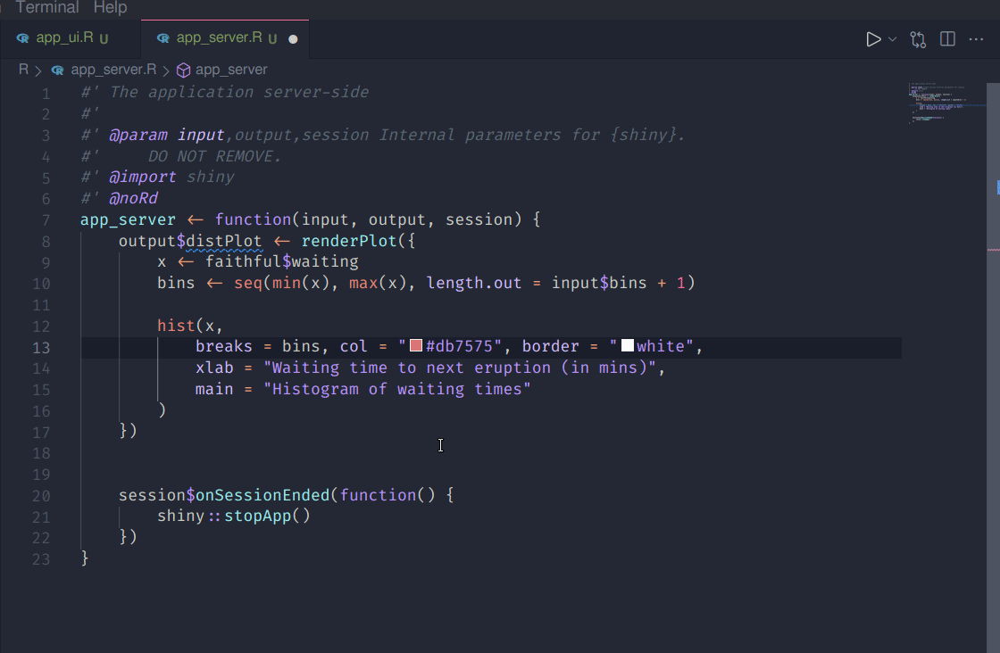

```{r setup, include=FALSE}
knitr::opts_chunk$set(echo = FALSE)
```

In this post I wanted to explore Shiny app development with Visual Studio Code (vscode) and the fantastic {golem} package. vscode has become a viable alternative to RStudio for development in R thanks to the excellent work by Yuki Ueda and Run Kun et al., https://github.com/REditorSupport  [VSCode-R extension](https://marketplace.visualstudio.com/items?itemName=Ikuyadeu.r) . While it's probably safe to say RStudio's IDE will remain the go-to for the majority of R users, vscode does offer some unique features that may be appeal for the adventurous R developer. 


### Setup

The [VSCode-R extension readme](https://github.com/REditorSupport/vscode-R#getting-started) is the best place to get started. Follow the instructions here to get all the necessary components installed.

- [vscode](https://code.visualstudio.com/)
- R >= 3.4 (If you didn't have R already..!)
- `install.packages("languageserver")` 

and of course [{golem}](https://github.com/ThinkR-open/golem/) for shiny development.

Optional but recommended for vscode

- [radian](https://github.com/randy3k/radian): Fancy R console
- [VSCode-R-Debugger](https://github.com/ManuelHentschel/VSCode-R-Debugger): Bug finder
- [{httpgd}](https://github.com/nx10/httpgd): Nice plots!


### Creating a new golem project

Two options here, you could first use RStudio to create a golem project using the new project GUI and then open the directory in vscode, OR, you can use `golem::create_golem()` to programatically create a new golem project from an R console and then open the directory in vscode.

<aside>
I feel like there could be a vscode-native way to do this but I couldn't find it...!
</aside>


### Keyboard shortcuts

There are several keyboard shortcuts you will likely want to add - `golem::run_dev()` is pretty much a must when creating a golem app! Below is an example of the entry you need to specify in your keyboard shortcuts json file:

```json
[
     {
        "description": "golem::run_dev()",
        "key": "ctrl+alt+r",
        "command": "r.runCommand",
        "when": "editorTextFocus",
        "args": "golem::run_dev()"
    }
]

```

See appendix for a few more shortcuts that I have found useful to have.

## Colour picker

This is quite a small feature but definitely something I think is lacking from RStudio - the ability to see a preview of the colours used


```{r}

```


## Live share feature

vscode has a great feature for pair programming through the use of live share. 

Something similar is available in RStudio workbench (paid/enterprise version of RStudio), but having the ability to use this feature for free is really nice. Here is an excellent post talking about it in more detail ...


## Managing libraries


Although I haven't personally run into this issue yet, I can see 

https://jozef.io/r300-language-server-setup/


# Appendix

### Shortcuts

```json

[
    {
        "key": "alt+-",
        "command": "type",
        "when": "editorLangId == r || editorLangId == rmd && editorTextFocus",
        "args": {
            "text": " <- "
        }
    },
    {
        "key": "ctrl+shift+m",
        "command": "type",
        "when": "editorLangId == r || editorLangId == rmd && editorTextFocus",
        "args": {
            "text": " %>% "
        }
    },
    {
        "key": "ctrl+shift+i",
        "command": "editor.action.insertSnippet",
        "when": "editorTextFocus",
        "args": {
            "snippet": "```{r}\n$0\n```"
        }
    },
    {
        "description": "golem::run_dev()",
        "key": "ctrl+alt+r",
        "command": "r.runCommand",
        "when": "editorTextFocus",
        "args": "golem::run_dev()"
    },
    {
        "description": "devtools::load_all()",
        "key": "ctrl+shift+l",
        "command": "r.loadAll",
        "when": "editorTextFocus",
        "args": "devtools::load_all()"
    }
]

```
